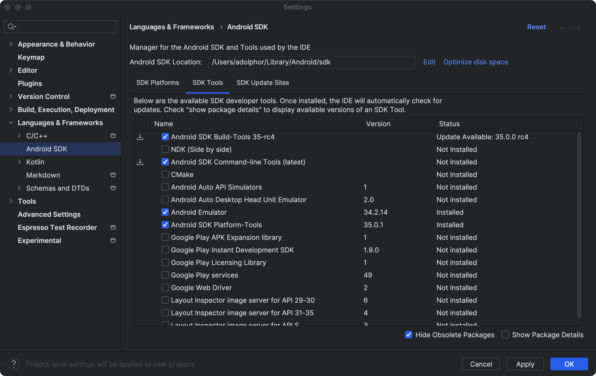

# my_tool

A new Flutter project.

# 环境配置

## 插件安装
* Flutter
* Flutter Snippets

## 环境配置
* brew install flutter
* 在idea中配置 brew 安装的 flutter SDK 路径

## android
安装 Android Studio 之后，你可以在 Android Studio 的设置中找到 Android SDK 的位置。在 Android Studio 的顶部菜单中，
选择 "Preferences"（或 "Settings"，取决于你的操作系统），然后在左侧的菜单中选择 
"Appearance & Behavior" > "System Settings" > "Android SDK"。在右侧的 "Android SDK Location" 中，
你可以看到 Android SDK 的路径。 

在这个路径下的 tools/bin/ 目录中，你应该可以找到 sdkmanager。你可以在命令行中使用这个路径来运行 sdkmanager。  
如果你在这个路径下没有找到 sdkmanager，那么可能是你的 Android SDK 没有完全安装。
在这种情况下，你可以在 Android Studio 的 "SDK Manager" 中选择安装 "Android SDK Command-line Tools"。



# 调试运行
```shell
# 检查可用设备
flutter devices
# 指定设备并启动
flutter run -d macos 
# 遇到macOS安全权限问题，执行如下命令，允许任何来源，以方便运行Dart和Flutter
sudo spctl --master-disable
# idea中热加载，选择Terminal窗口后，键盘输入
# r：热更新
# R：热重启
```

日志信息如下：
```
flutter run -d macos                                                                                                        ✔  17:51:46 
Launching lib/main.dart on macOS in debug mode...
Building macOS application...                                           
Syncing files to device macOS...                                    92ms

Flutter run key commands.
r Hot reload. 🔥🔥🔥
R Hot restart.
h List all available interactive commands.
d Detach (terminate "flutter run" but leave application running).
c Clear the screen
q Quit (terminate the application on the device).

A Dart VM Service on macOS is available at: http://127.0.0.1:54058/mM1JSv0wPUM=/
The Flutter DevTools debugger and profiler on macOS is available at: http://127.0.0.1:9100?uri=http://127.0.0.1:54058/mM1JSv0wPUM=/

Performing hot reload...                                                
Reloaded 1 of 698 libraries in 428ms (compile: 59 ms, reload: 114 ms, reassemble: 217 ms).
```

# build

有问题可以使用清理命令：
```shell
flutter clean
```

## iOS

### 方式1
```shell
# 预编译和环境准备
rm -rf .dart_tool/
rm -rf build/
flutter build ios --release
mkdir -p ./build/ios/Payload
cp -rf ./build/ios/Release-iphoneos/Runner.app ./build/ios/Payload
cd ./build/ios && zip -r myTool.ipa Payload && cd ../..
# https://esign.yyyue.xyz
```

### 方式2
```shell
# 预编译和环境准备
flutter build ios --release
# xcode操作
# 1、product => archive
# 2、生成的archives所在文件目录：/Users/adolphor/Library/Developer/Xcode/Archives
# 3、显示包内容 -> Products -> Applications
# 4、创建 Payload 文件夹，将 Runner 拖拽到文件夹内
# 5、压缩为zip包，并修改文件后缀为ipa，也可以将文件名修改为自己想要的名字
# 6、使用爱思助手安装到手机即可
```

## macos
```shell
flutter build macos --release -t lib/main.dart
cd ./build/macos/Build/Products/Release/ && open . 
```


## 参考
* [网速监控组件](https://pub.dev/packages/internet_speed_test)
* [在Flutter中在网速小于100kb时显示消息](https://www.volcengine.com/theme/4768282-R-7-1)
* [flutter实战之常用模块：network_info_plus模块及其应用](https://bbs.huaweicloud.com/blogs/405630)
* [Flutter 集成 Golang ](https://juejin.cn/post/7109806986006364196)
* [iOS SDK、Simulator 下载](https://developer.apple.com/download/all/)

